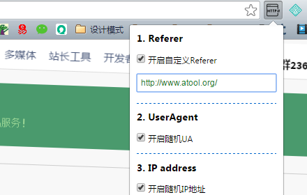

## [header-customize]

一个Chrome浏览器插件，用于自定义HTTP的header信息，用于保护referer、UA、IP等隐私信息。使用效果如下图所示：

意见反馈及主页: [http://www.atool.org/](http://www.atool.org/)

### 一、安装方法

1. Chrome插件商店下载地址：[https://chrome.google.com/webstore/detail/header%E8%87%AA%E5%AE%9A%E4%B9%89%E5%B7%A5%E5%85%B7/maaccnhcoaehdeehahenkmchinbdjjmi](https://chrome.google.com/webstore/detail/header%E8%87%AA%E5%AE%9A%E4%B9%89%E5%B7%A5%E5%85%B7/maaccnhcoaehdeehahenkmchinbdjjmi)。【推荐】
2. 自己下载本项目代码使用，拖入到浏览器中安装即可。
3. 备注：请勿自行分发。

### 二、目地背景

最开始做这个的原因是，www.atool.org最近有很来访问来源的其他网站来源，当时进去看的时候，却并没有什么链接，所以想到应该是修改referer的方式来伪造访问来源。

然后进一步想到，很多10元刷1w自然流量的广告，感觉他们的做法应该是大量刷referer，然后再网站流量统计中占有很高的排名，然后站长看到之后会因为好奇点到referer网站查看，从而形成自然流量。

1. 做一个自定义referer的插件，自己为自己刷自然流量
2. 伪造UA、伪造IP来隐藏自己的上网信息，同时提高referer的IP流量数
3. 学学chrome插件开发

### 三、后续工作

1. 更多的HTTP header配置；